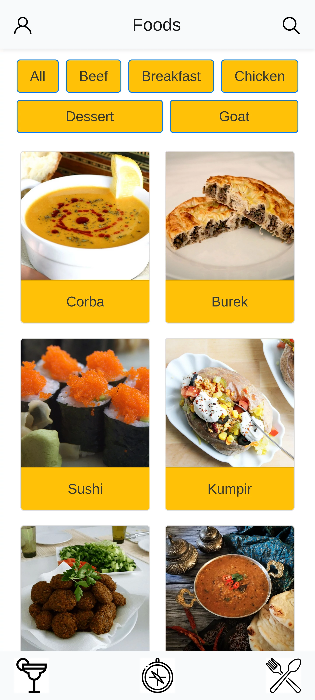
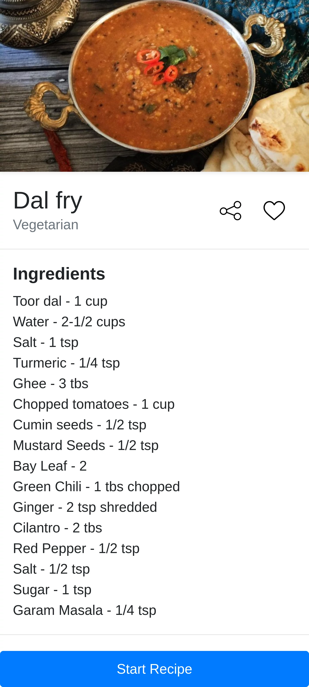
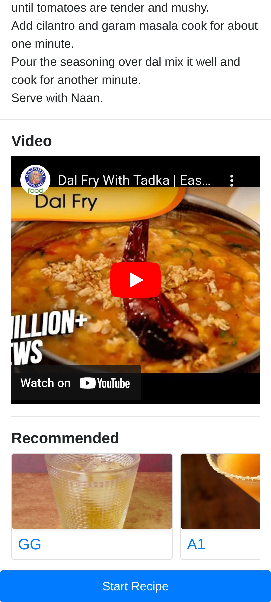

# Sobre

## Seção: `Metodologias Ágeis`

- Ultima seção do módulo de frontend, realizando um projeto livre para escolha de gerenciador de estados e desenvolvimento visual de estilos em um grupo organizado pela trybe.
#

  

>*clique na imagem para acesso online do projeto*
#
## Projeto: `Recipes App`

- Aplicação focado em mobile first que apresenta diversas receitas, seja de comida ou bebidas coletadas de duas APIs, [the meal](https://www.themealdb.com/) e [the cocktail](https://www.thecocktaildb.com/). Onde podemos favoritar as receitas, simular o início da receita, marcando passos realizados durante seu preparo, compartilhando o link da receita para enviar para outras pessoas, sendo possível explorar receitas por nacionalidade ou ingredientes específicos, e também de forma aleatória com o "surprise me!".
# Tecnologias e ferramentas usadas 🛠

# Desafios

- Lidar com a padronização diferentes do retorno das API's, elas são muito similares, mas não seguiam um padrão total, para resolver esse desafio um dos integrantes criar uma funcionalidade incrível para padronizar de forma simples e eficiente, facilitando nosso trabalho durante o desenvolvimento!

# Conclusão

- Foi ótimo trabalhar e conhecer novas pessoas com propostas interessantes, adorei o fato de termos usado o redux ao invés do context API nesse projeto, pois deixou claro que o redux tem uma configuração muito longa com o react usando classes, mas usando o react funcional, redux é tão simples quanto context API, que eu particularmente achei o redux uma forma mais organizada de gerenciar os estados.

  

    <strong>
      :newspaper_roll: Requisitos solicitados durante o desenvolvimento do projeto
    </strong>
  

 
### Requisitos
*Nome* | *Avaliação*
--- | :---:
87 - Redirecione a pessoa usuária que, ao clicar no botão de "Logout", o `localStorage` deve ser limpo e a rota deve mudar para a tela de login | :heavy_check_mark:
86 - Redirecione a pessoa usuária que, ao clicar no botão de "Favorite Recipes", a rota deve mudar para a tela de receitas favoritas | :heavy_check_mark:
85 - Redirecione a pessoa usuária que, ao clicar no botão de "Done Recipes", a rota deve mudar para a tela de receitas feitas | :heavy_check_mark:
84 - Implemente 3 botões: um de nome "Done Recipes", um de nome "Favorite Recipes" e um de nome "Logout" | :heavy_check_mark:
83 - Implemente a solução de maneira que o e-mail da pessoa usuária deve estar visível | :heavy_check_mark:
82 - Implemente os elementos da a tela de perfil respeitando os atributos descritos no protótipo | :heavy_check_mark:
81 - Implemente a rota que deve ser apenas `/explore/foods/nationalities` | :heavy_check_mark:
80 - Implemente o dropdown de maneira que devem estar disponíveis todas as áreas retornadas da API, incluindo a opção "All", que retorna as receitas sem nenhum filtro | :heavy_check_mark:
79 - Desenvolva as mesmas especificações da tela de receitas principal, com a diferença de que os filtros de categoria são substituídos por um dropdown | :heavy_check_mark:
78 - Implemente os elementos da tela de explorar por nacionalidades respeitando os atributos descritos no protótipo | :heavy_check_mark:
77 -  Redireciona a pessoa usuária ao clicar no card do ingrediente, a rota deve mudar para tela principal de receitas mas mostrando apenas as receitas que contém o ingrediente escolhido | :heavy_check_mark:
76 - Desenvolva cards para os 12 primeiros ingredientes, de forma que cada card contenha o nome do ingrediente e uma foto | :heavy_check_mark:
75 - Implemente os elementos da tela de explorar ingredientes respeitando os atributos descritos no protótipo | :heavy_check_mark:
74 - Redirecione a pessoa usuária ao clicar em "Surprise me!", a rota deve mudar para a tela de detalhes de uma receita, que deve ser escolhida de forma aleatória através da API | :heavy_check_mark:
73 - Redirecione a pessoa usuária ao clicar em "By Nationality", a rota deve mudar para tela de explorar por nacionalidades | :heavy_check_mark:
72 - Redirecione a pessoa usuária ao clicar em "By Ingredient", a rota deve mudar para a tela de explorar por ingredientes | :heavy_check_mark:
71 - Desenvolva 3 botões: um para explorar por ingrediente, um para explorar por nacionalidade e um para pegar uma receita aleatória | :heavy_check_mark:
70 - Implemente os elementos da tela de explorar bebidas ou comidas respeitando os atributos descritos no protótipo | :heavy_check_mark:
69 - Redirecione a pessoa usuária ao clicar em um dos botões, a rota deve mudar para a página de explorar comidas ou de explorar bebidas | :heavy_check_mark:
68 - Desenvolva a tela de maneira que tenha 2 botões: um para explorar comidas e o outro para explorar bebidas | :heavy_check_mark:
67 - Implemente os elementos da tela de explorar respeitando os atributos descritos no protótipo | :heavy_check_mark:
66 - Redirecione a pessoa usuária ao clicar na foto ou no nome da receita, a rota deve mudar para a tela de detalhes daquela receita | :heavy_check_mark:
65 - Implemente 2 botões que filtram as receitas por comida ou bebida e um terceiro que remove todos os filtros | :heavy_check_mark:
64 - Desenvolva a solução de maneira que o botão de "desfavoritar" deve remover a receita da lista de receitas favoritas do `localStorage` e da tela | :heavy_check_mark:
63 - Desenvolva a solução de maneira que o botão de compartilhar deve copiar a URL da tela de detalhes da receita para o clipboard | :heavy_check_mark:
62 - Desenvolva a tela de maneira que, caso a receita do card seja uma bebida, ela deve possuir: a foto da receita, o nome, se é alcoólica ou não, um botão de compartilhar e um de "desfavoritar" | :heavy_check_mark:
61 - Desenvolva a tela de maneira que, caso a receita do card seja uma comida, ela deve possuir: a foto da receita, o nome, a categoria, a nacionalidade, um botão de compartilhar e um de "desfavoritar" | :heavy_check_mark:
60 - Implemente os elementos da tela de receitas favoritas (cumulativo com os atributos em comum com a tela de receitas feitas) respeitando os atributos descritos no protótipo | :heavy_check_mark:
59 - Redirecione para a tela de detalhes da receita caso seja clicado na foto ou no nome da receita | :heavy_check_mark:
58 - Implemente 2 botões que filtram as receitas por comida ou bebida e um terceiro que remove todos os filtros | :heavy_check_mark:
57 - Desenvolva a solução de maneira que o botão de compartilhar deve copiar a URL da tela de detalhes da receita para o clipboard | :heavy_check_mark:
56 - Desenvolva a tela de maneira que, caso a receita do card seja uma bebida, ela deve possuir: a foto da receita, o nome, se é alcoólica, a data em que a pessoa fez a receita e um botão de compartilhar | :heavy_check_mark:
55 - Desenvolva a tela de maneira que, caso a receita do card seja uma comida, ela deve possuir: a foto da receita, o nome, a categoria, a nacionalidade, a data em que a pessoa fez a receita, as 2 primeiras tags retornadas pela API e um botão de compartilhar | :heavy_check_mark:
54 - Implemente os elementos da tela de receitas feitas respeitando os atributos descritos no protótipo | :heavy_check_mark:
53 - Redirecione a pessoa usuária após clicar no botão de finalizar receita ("Finish Recipe"), para a página de receitas feitas, cuja rota deve ser `/done-recipes` | :heavy_check_mark:
52 - Implemente a solução de maneira que o botão de finalizar receita ("Finish Recipe") só pode estar habilitado quando todos os ingredientes estiverem _"checkados"_ (marcados) | :heavy_check_mark:
51 - Desenvolva a lógica de favoritar e compartilhar, a lógica da tela de detalhes de uma receita se aplica aqui | :heavy_check_mark:
50 - Salve o estado do progresso, que deve ser mantido caso a pessoa atualize a página ou volte para a mesma receita | :heavy_check_mark:
49 - Implemente uma lógica que, ao clicar no checkbox de um ingrediente, o nome dele deve ser "riscado" da lista | :heavy_check_mark:
48 - Desenvolva um checkbox para cada item da lista de ingredientes | :heavy_check_mark:
47 - Desenvolva a tela de maneira que contenha uma imagem da receita, seu titulo, sua categoria (ou se a bebida é alcoólica ou não) uma lista de ingredientes com suas respectivas quantidades e suas instruções | :heavy_check_mark:
46 - Salve as receitas favoritas no `localStorage` na chave `favoriteRecipes` | :heavy_check_mark:
45 - Implemente a lógica no botão de favoritar, caso seja clicado, o ícone do coração deve mudar seu estado atual, caso esteja preenchido deve mudar para "despreenchido" e vice-versa | :heavy_check_mark:
44 - Implemente o ícone do coração (favorito) de maneira que, deve vir preenchido caso a receita esteja favoritada e "despreenchido" caso contrário | :heavy_check_mark:
43 - Implemente a solução de forma que, ao clicar no botão de compartilhar, o link da receita dentro do app deve ser copiado para o clipboard e uma mensagem avisando que o link foi copiado deve aparecer | :heavy_check_mark:
42 - Implemente um botão de compartilhar e um de favoritar a receita | :heavy_check_mark:
41 - Redirecione a pessoa usuária caso o botão "Start Recipe" seja clicado, a rota deve mudar para a tela de receita em progresso | :heavy_check_mark:
40 - Implemente a solução de modo que caso a receita tenha sido iniciada mas não finalizada, o texto do botão deve ser "Continue Recipe" | :heavy_check_mark:
39 - Implemente a solução de forma que caso a receita já tenha sido feita, o botão "Start Recipe" deve sumir | :heavy_check_mark:
38 - Desenvolva um botão de nome "Start Recipe" que deve ficar fixo na parte de baixo da tela o tempo todo | :heavy_check_mark:
37 - Implemente os cards de recomendação, onde serão 6 cards, mas mostrando apenas 2 e o scroll é horizontal, similar a um `carousel` | :heavy_check_mark:
36 - Implemente as recomendações, para receitas de comida, a recomendação deverá ser bebida e vice-versa | :heavy_check_mark:
35 - Desenvolva a tela de forma que contenha uma imagem da receita, o título, a categoria (ou se é ou não alcoólico), uma lista de ingredientes seguidos pelas quantidades, instruções, um vídeo do youtube "embedado" e recomendações | :heavy_check_mark:
34 - Realize uma request para a API passando o `id` da receita que deve estar disponível nos parâmetros da URL | :heavy_check_mark:
33 - Implemente os elementos da tela de detalhes de uma receita respeitando os atributos descritos no protótipo | :heavy_check_mark:
32 - Redirecione a pessoa usuária, ao clicar no card, para a tela de detalhes, que deve mudar a rota e conter o id da receita na URL | :heavy_check_mark:
31 - Desenvolva o filtro de categorias com a opção de filtrar por todas as categorias | :heavy_check_mark:
30 - Implemente o filtro de categoria para que apenas um seja selecionado por vez | :heavy_check_mark:
29 - Implemente o filtro como um toggle, que se for selecionado de novo, o app deve retornar as receitas sem nenhum filtro | :heavy_check_mark:
28 - Implemente o filtro das receitas através da API ao clicar no filtro de categoria | :heavy_check_mark:
27 - Implemente os botões de categoria para serem utilizados como filtro | :heavy_check_mark:
26 - Carregue as 12 primeiras receitas de comidas ou bebidas, uma em cada card | :heavy_check_mark:
25 - Implemente os elementos da tela principal de receitas respeitando os atributos descritos no protótipo | :heavy_check_mark:
24 - Redirecione a pessoa usuárua para uma lista de comidas ao clicar no ícone de comidas | :heavy_check_mark:
23 - Redirecione a pessoa usuária para a tela de explorar ao clicar no ícone de exploração | :heavy_check_mark:
22 - Redirecione a pessoa usuária para uma lista de cocktails ao clicar no ícone de bebidas | :heavy_check_mark:
21 - Exiba o menu inferior apenas nas telas indicadas pelo protótipo | :heavy_check_mark:
20 - Posicione o menu inferior de forma fixa e apresente 3 ícones: um para comidas, um para bebidas e outro para exploração | :heavy_check_mark:
19 - Implemente os elementos do menu inferior respeitando os atributos descritos no protótipo | :heavy_check_mark:
18 - Exiba um `alert` caso nenhuma receita seja encontrada | :heavy_check_mark:
17 - Mostre as receitas em cards caso mais de uma receita seja encontrada | :heavy_check_mark:
16 - Redirecione para a tela de detalhes da receita caso apenas uma receita seja encontrada, com o ID da mesma na URL | :heavy_check_mark:
15 - Busque na API de comidas caso a pessoa esteja na página de comidas e na de bebidas caso esteja na de bebidas | :heavy_check_mark:
14 - Posicione a barra logo abaixo do header e implemente 3 radio buttons: Ingredient, Name e First letter | :heavy_check_mark:
13 - Implemente os elementos da barra de busca respeitando os atributos descritos no protótipo | :heavy_check_mark:
12 - Desenvolva o botão de busca que, ao ser clicado, a barra de busca deve aparecer. O mesmo serve para escondê-la | :heavy_check_mark:
11 - Redirecione a pessoa usuária para a tela de perfil ao clicar no botão de perfil | :heavy_check_mark:
10 - Implemente um ícone para a tela de perfil, um título e um ícone para a busca, caso exista no protótipo | :heavy_check_mark:
9 - Implemente os elementos do header na tela principal de receitas, respeitando os atributos descritos no protótipo | :heavy_check_mark:
8 - Redirecione a pessoa usuária para a tela principal de receitas de comidas após a submissão e validação com sucesso do login | :heavy_check_mark:
7 - Salve o e-mail da pessoa usuária no localStorage na chave user após a submissão | :heavy_check_mark:
6 - Salve 2 tokens no localStorage após a submissão, identificados pelas chaves mealsToken e cocktailsToken | :heavy_check_mark:
5 - Desenvolva a tela de maneira que o formulário só seja válido após um email válido e uma senha de mais de 6 caracteres serem preenchidos | :heavy_check_mark:
4 - Desenvolva a tela de maneira que a pessoa deve conseguir escrever sua senha no input de senha | :heavy_check_mark:
3 - Desenvolva a tela de maneira que a pessoa deve conseguir escrever seu email no input de email | :heavy_check_mark:
2 - Crie todos os elementos que devem respeitar os atributos descritos no protótipo para a tela de login | :heavy_check_mark:

  

    <strong>
      :memo: Todo list
    </strong>
  

  - [x] - ~~Criar aplicação com base nos requisitos da trybe.~~ 
  - [ ] - Revisar Estilo dos elementos da página.
  - [ ] - Desenvolver testes automatizados.

#
## Membros:

  <a href="https://www.linkedin.com/in/davidrogger">
    
  <a href="https://www.linkedin.com/in/evandro-albuquerque-77a82385">
    
  <a href="https://www.linkedin.com/in/gabrielgrippa">
    
  <a href="https://www.linkedin.com/in/viniciusdotjson">
    

#

  

